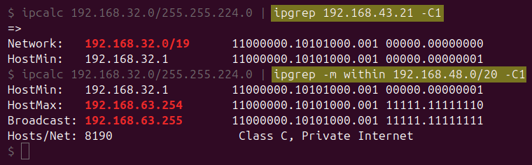

ipgrep
======

Search IP addresses and networks in text files.

*It's grep, except instead of regular expressions, the needle is an
IP-CIDR. The match-mode decides whether your CIDR is contained-in or
containing the haystack.*

|EXAMPLE|

--------
Examples
--------

*Find IPs or ranges in which your needle fits*::

    $ ipgrep 192.168.1.1,172.17.1.2 /etc/firejail/nolocal.net
    -A OUTPUT -d 192.168.0.0/16 -j DROP
    -A OUTPUT -d 172.16.0.0/12 -j DROP

*Find IPs contained inside your supplied ranges*::

    $ ip -br a | ipgrep 127.0.0.0/8 -m within
    lo               UNKNOWN        127.0.0.1/8 ::1/128

**NOTE: The default -m mode changes from "contains" to "within" when the
any needle is a network larger than a single IP.**

*Find exact IP matches*::

    $ ip -br a | ipgrep 0:0:0:0:0:0:0:1 -m equals
    lo               UNKNOWN        127.0.0.1/8 ::1/128

*Find and show only the matches*::

    $ ip -br a | ipgrep 127.0.0.1,::1 -o
    127.0.0.1/8
    ::1/128

*Supports IPv6*::

    $ ipgrep fe00::/7 /etc/hosts -m within
    fe00::0 ip6-localnet
    ff00::0 ip6-mcastprefix
    ff02::1 ip6-allnodes
    ff02::2 ip6-allrouters

*Looking for IPv4-mapped IPv6 addresses?*::

    $ echo ::ffff:127.0.0.1 | ipgrep ::ffff:0:0/96 -m w
    ::ffff:127.0.0.1

-----
Usage
-----

The following help was created before any development was done::

    ipgrep 0.1.0 - Search IP addresses and networks in text files

    Usage:
      ipgrep [OPTIONS] NEEDLES [HAYSTACK...]
      cat file.txt | ipgrep [OPTIONS] NEEDLES

    Needles are IPs or networks (e.g. 192.0.2.1, 2001:db8::/32).
    Multiple needles may be separated by commas or repeated.

    Haystacks are one or more files. If none given, stdin is read.

    The haystack lines may contain multiple IPs. These possible matches are
    referred to as items below.

    The options follow (closely mimicking grep options).

    Generic Program Information:
      --help                    Output a usage message and exit
      -V, --version             Print version and exit

    Matching Control:
      -a, --accept <MODE>       Accept input forms (may repeat or use commas):
                                  ip     - bare host IP
                                  net    - valid network (CIDR)
                                  oldnet - valid network (host/dotted-netmask)
                                  iface  - interface IP (host/mask)
                                  [default: ip,net,iface]
      -I, --interface-mode      Select interface IP matching mode (default: ip):
                                  ip       - treat as single IP
                                  net      - treat as if network bits were unset
                                  complain - complain/reject network bits
      -m, --match <TYPE>        Match mode (default: contains):
                                  contains - haystack net contains needle net
                                  within   - needle net contains haystack net
                                  equals   - exact IP or network equality
                                  overlaps - haystack and needle nets overlap

    General Output Control:
      -c, --count               Print only a count of matching items
      -l, --files-with-matches  List filenames with matches only
      -o, --only-matching       Print only the matching IPs/networks
      -q, --quiet               Quiet; exit status only

    Output Line Prefix Control:
      -h, --no-filename         Suppress filename prefix on output
      -n, --line-number         Prefix each output line (or item) with lineno
      -Z, --null                Output a zero byte instead of LF in output;
                                only useful in combination with -l

    Context Line Control:
      -A NUM, --after-context=NUM   Print NUM context lines before a match
      -B NUM, --before-context=NUM  Print NUM context lines after a match
      -C NUM, --context=NUM         Shorthand for -A NUM -B NUM

    File and Directory Selection:
      -r, --recursive               Read files under each directory, recursively
      -R, --dereference-recursive   Dereference symlinks while doing so

    Other Options:
      --line-buffered           Disable output buffering when writing to non-tty

    Exit status:
      0 if match found
      1 if no match found
      2 if error

    Example invocations:
      # Look for a few IPs in all networks found in /etc.
      ipgrep -C 5 -a net -a oldnet -r 192.168.2.5,192.168.2.78 /etc/*

      # Output linefeed separated IPs of all IPv4 hosts/interfaces.
      ipgrep -m within -o 0.0.0.0/0 input.txt

It's slightly more readable/concise than the Rust clap output.
See ``ipgrep --help`` for the actual output, which should be 100% compatible.

--------------------------
Prior art / feature parity
--------------------------

Obviously *ossobv/ipgrep* isn't the first tool that searches for IPs.
And apparently, there are several applications called ``ipgrep``
already, and then a few called ``cidrgrep``, ``cidr-grep`` and
``grepcidr``. Here's an attempt at enumerating other versions and their
features. Ordered by feature-completeness.

+--------------------------------------+----------+----------+----------+----------+----------+----------+-----------+----------+----------+----------+----------+----------+----------+
| Features in application              | ipgrep   | grep     | grepcidr | grepcidr | ipgrep   | ipgrep   | cidr-grep | cidrgrep | ipgrep   | ipgrep   | ipgrep   | ipgrep   | ...      |
+======================================+==========+==========+==========+==========+==========+==========+===========+==========+==========+==========+==========+==========+==========+
| Author/source                        | ossobv_  | POSIX    | levine_  | berkes_  | robrwo_  | joonas_  | pangraz_  | doherty_ | dmages_  | jstarke_ | princeb_ | jesdict_ | ...      |
+--------------------------------------+----------+----------+----------+----------+----------+----------+-----------+----------+----------+----------+----------+----------+----------+
| Version                              | 0.1.3    | *many*   | 3.02     | 2.0      | 0.7.0    | 0.3.2    | 1.0.3     | *none*   | 0.2      | 0.2.0    | *none*   | 1.0.1    | ❔       |
+--------------------------------------+----------+----------+----------+----------+----------+----------+-----------+----------+----------+----------+----------+----------+----------+
| Last updated                         | 2025     | 2025     | 2025     | 2014     | 2023     | 2025     | 2015      | 2020     | 2019     | 2023     | 2016     | 2023     | ❔       |
+--------------------------------------+----------+----------+----------+----------+----------+----------+-----------+----------+----------+----------+----------+----------+----------+
| Programming language                 | rust     | C        | C        | C        | perl     | golang   | nodejs    | golang   | perl     | rust     | golang   | python   | ❔       |
+--------------------------------------+----------+----------+----------+----------+----------+----------+-----------+----------+----------+----------+----------+----------+----------+
| IP address aware [1]_                | ✅       | ❌       | ✅ [6]_  | ✅       | ✅ [6]_  | ✅ [6]_  | ✅        | ✅ [6]_  | ✅       | ✅       | ✅ [6]_  | ✅       | ❔       |
+--------------------------------------+----------+----------+----------+----------+----------+----------+-----------+----------+----------+----------+----------+----------+----------+
| Search by needle(s) [2]_             | ✅       | ✅       | 🟡 [2]_  | 🟡 [2]_  | 🟡 [2]_  | 🟡       | ✅        | 🟡       | 🟡       | ❌       | ❌       | ❌       | ❔       |
+--------------------------------------+----------+----------+----------+----------+----------+----------+-----------+----------+----------+----------+----------+----------+----------+
| Search by IP class (e.g. "public")   | ⏳ #3    | ❌       | ❌       | ❌       | ❌       | ❌       | ❌        | ❌       | ❌       | ✅       | ❌       | ❌       | ❔       |
+--------------------------------------+----------+----------+----------+----------+----------+----------+-----------+----------+----------+----------+----------+----------+----------+
| Network/CIDR "contains" match        | ✅       | ❌       | ✅       | ✅       | ✅       | ✅       | ✅        | ✅       | ✅       | ❌       | ❌       | ❌       | ❔       |
+--------------------------------------+----------+----------+----------+----------+----------+----------+-----------+----------+----------+----------+----------+----------+----------+
| Handles legacy 1.2.3.0m255.255.255.0 | ❌       | ❌       | ❌       | ❌       | ❌       | ✅       | ❌        | ❌       | ❌       | ❌       | ❌       | ❌       | ❔       |
+--------------------------------------+----------+----------+----------+----------+----------+----------+-----------+----------+----------+----------+----------+----------+----------+
| Handles IPv6                         | ✅       | ✅ [1]_  | ✅       | ✅       | ✅       | ✅       | ❌        | ❌       | ❌ [7]_  | ❌       | ✅       | ❌       | ❔       |
+--------------------------------------+----------+----------+----------+----------+----------+----------+-----------+----------+----------+----------+----------+----------+----------+
| Search multiple files                | ✅       | ✅       | ✅       | ✅       | ✅       | ✅       | ✅        | ✅       | 🟡 [7]_  | ✅       | ✅       | ✅       | ❔       |
+--------------------------------------+----------+----------+----------+----------+----------+----------+-----------+----------+----------+----------+----------+----------+----------+
| Search directories recursively       | ✅       | ✅       | ❌       | ❌       | ❌       | ❌       | ❌        | ❌       | ❌       | ❌       | ❌       | ❌       | ❔       |
+--------------------------------------+----------+----------+----------+----------+----------+----------+-----------+----------+----------+----------+----------+----------+----------+
| Highlight/colorize matches           | ✅       | ✅       | ❌       | ❌       | ❌       | ❌       | ❌        | ❌       | ❌       | ✅       | ❌       | ❌       | ❔       |
+--------------------------------------+----------+----------+----------+----------+----------+----------+-----------+----------+----------+----------+----------+----------+----------+
| Extract only IPs (-o) [3]_           | ✅       | ✅       | ✅       | ✅       | ✅       | ❌       | ❌        | ❌       | ❌       | ❌       | 🟡       | 🟡       | ❔       |
+--------------------------------------+----------+----------+----------+----------+----------+----------+-----------+----------+----------+----------+----------+----------+----------+
| Support negative match (-v)          | ⏳ #2    | ✅       | ✅       | ✅       | ✅       | ❌       | ❌        | ❌       | ❌       | ✅       | ❌       | ❌       | ❔       |
+--------------------------------------+----------+----------+----------+----------+----------+----------+-----------+----------+----------+----------+----------+----------+----------+
| Support showing context lines (-C)   | ✅       | ✅       | ❌       | ❌       | ❌       | ❌       | ❌        | ❌       | ❌       | ❌       | ❌       | ❌       | ❔       |
+--------------------------------------+----------+----------+----------+----------+----------+----------+-----------+----------+----------+----------+----------+----------+----------+
| Support showing counts (-c)          | ✅       | ✅       | ✅       | ✅       | ✅       | ❌       | ❌        | ❌       | ❌       | ❌       | ❌       | ❌       | ❔       |
+--------------------------------------+----------+----------+----------+----------+----------+----------+-----------+----------+----------+----------+----------+----------+----------+
| Deobfuscate / resolve hostnames [4]_ | ❌       | ❌       | ❌       | ❌       | ❌       | ❌       | ❌        | ❌       | ❌       | ❌       | ❌       | ✅       | ❔       |
+--------------------------------------+----------+----------+----------+----------+----------+----------+-----------+----------+----------+----------+----------+----------+----------+
| Run duration [5]_                    | **1**    | ∅        | **1.3**  | **1.8**  | **3.7**  | **4.2**  | ∅         | ∅        | ∅        | ∅        | ∅        | ∅        | ❔       |
+--------------------------------------+----------+----------+----------+----------+----------+----------+-----------+----------+----------+----------+----------+----------+----------+
| ...                                  | ❔       | ❔       | ❔       | ❔       | ❔       | ❔       | ❔        | ❔       | ❔       | ❔       | ❔       | ❔       | ❔       |
+--------------------------------------+----------+----------+----------+----------+----------+----------+-----------+----------+----------+----------+----------+----------+----------+

**In the above table ⏳ might mean that it's under consideration. Not
that it's necessarily coming soon.**

.. [1] **POSIX grep** does not have any notion of IP addresses,
   but it can match both IPv4 and IPv6 if you provide the right
   regular expression.
.. [2] Most tools only allow searching by a single needle IP or CIDR.
   Some tools do allow multiple needles specified through a file,
   but specifying those using bash process substitution fails because
   that file is reread for each opened haystack file.
.. [3] Better tools support extracting only IPs using a ``-o`` flag, or
   similar. Other implementations either return full lines or only IPs,
   without an option to switch.
.. [4] **jesdict1/ipgrep** detects obfuscated hostnames such as
   ``hxxp://`` and ``www[.]example[.]com`` and resolves them. This
   feature is not planned for **ossobv/ipgrep**.
.. [5] Run duration is a non-scientific test over the same dataset.
   The fastest one has a duration of 1.
   Only tools that could reasonably be compared were eligible.
.. [6] **robrwo/ipgrep**, **jrlevine/grepcidr** and **tomdoherty/cidrgrep**
   consider ``([0-9]+[.]){4}[0-9]`` to be valid, while those are
   generally ASN.1 object identifiers.
   **princebot/ipgrep** and the **berkes/grepcidr** tools don't consider
   ``([0-9]+[.]){4}[.]`` valid while that would be a valid the end of a
   sentence.
   **joneskoo/ipgrep** won't list "commented out" IPs.
.. [7] **digitalmages/ipgrep** doesn't know what ``::/0`` is. So we can't
   trust this for IPv6. **digitalmages/ipgrep** also dies as soon as it
   has trouble reading a file.

Other tools not shown in the list:

* markust_: **markusthilo/ipgrep** (v0.3, 2020, C) merges and filters PCAP files.

.. _ossobv: https://github.com/ossobv/ipgrep
.. _berkes: https://www.pc-tools.net/unix/grepcidr/
.. _dmages: http://www.digitalmages.com/projects/misc-network-tools/man/man1/ipgrep.html
.. _doherty: https://github.com/tomdoherty/cidrgrep
.. _jesdict: https://github.com/jedisct1/ipgrep
.. _joonas: https://github.com/joneskoo/ipgrep
.. _jstarke: https://github.com/janstarke/ipgrep
.. _levine: https://github.com/jrlevine/grepcidr3
.. _markust: https://github.com/markusthilo/ipgrep
.. _pangraz: https://github.com/mpangrazzi/cidr-grep
.. _princeb: https://github.com/princebot/ipgrep
.. _robrwo: https://github.com/robrwo/perl-ipgrep

-------
License
-------

GPLv3+

-----------------
Things left to do
-----------------

- Maybe make colored output option. Right now you can always disable it
  by piping to ``cat``.
- There are a few *TODOs* in the source to tackle. Not a big priority.

